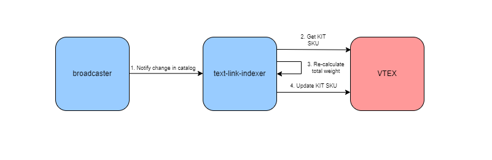
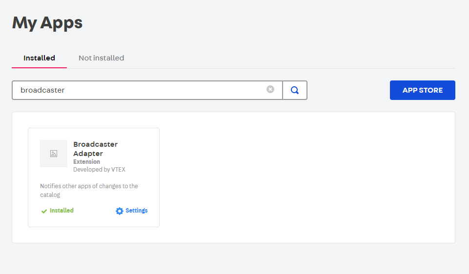

# Text link fixer

App in VTEX that receives a notification when a SKU is changed or created, if the associated product contains spaces in its text-link, this will be cleaned from spaces.

## How it works?

## How to install

⚠️ First, make sure the broadcaster app is installed.

Run command: `vtex install vtex.kit-indexer`
